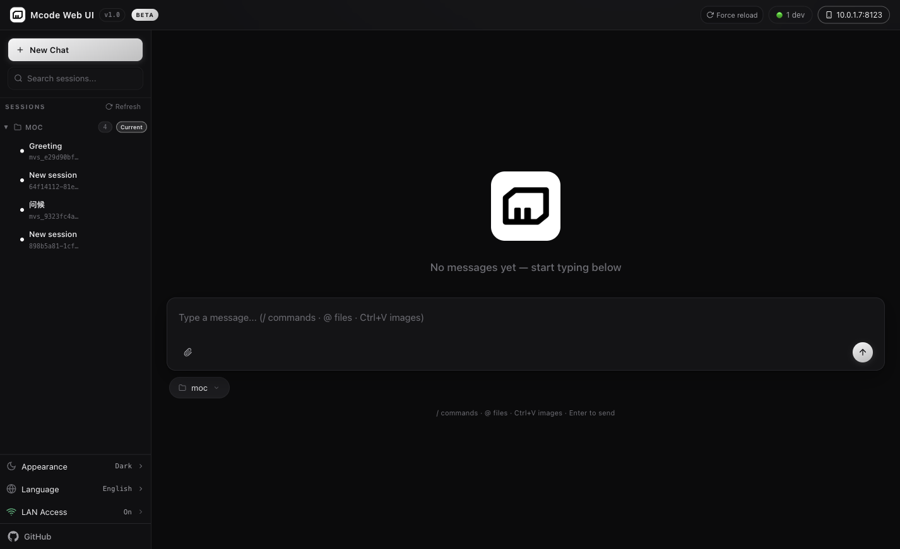
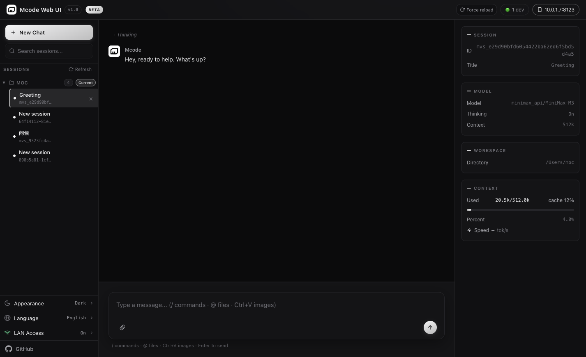
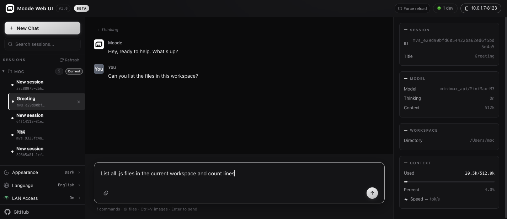
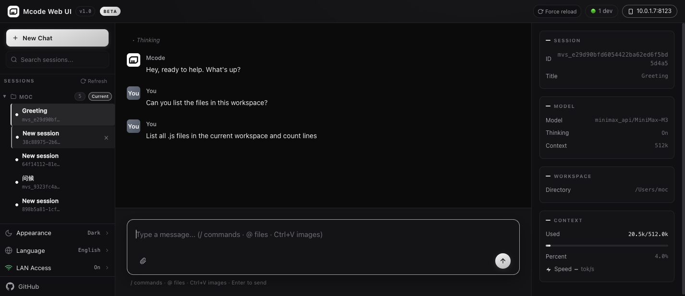

# mcode Web UI

**[English](README.md) | [简体中文](README.zh-CN.md)**

`mcode` 命令行工具的**浏览器前端** —— 在浏览器里跑 `mcode`，
不用占用终端。直接对接 mcode 自有的协议（`mcode acp` JSON-RPC +
`mcode exec` stream-json），不是 TUI 套壳。**零 npm 运行时依赖**
（只用 Node 22+ 标准库）。

> 三栏布局（会话 / 对话 / 上下文），`/` 命令搜索，附件上传，
> 套餐用量右向展开，token 鉴权局域网，移动端响应。

```
[浏览器 :8080] ←─ SSE /api/events ─ [Node server.js] ─ mcode acp / exec ─ [mcode CLI]
      │                                     │
      └──── REST /api/* ────────────────────┴── ~/.minimax/v2 sqlite（读 + 删会话）
```

## 功能

- **三栏布局** —— 会话列表 / 对话区 / 上下文面板
- **实时流式输出** —— 模型输出、工具事件（Bash / Read / Edit /
  Glob / Grep / WebFetch …）、智能体思考片段
- **斜杠命令搜索** —— `/` 打开面板，模糊搜索 mcode 内置命令 +
  webui 自定义命令
- **文件附件** —— 点击 / 拖拽 / Ctrl+V 粘贴；以 `@file` 形式注入
- **用量面板** —— 右侧可展开：5 小时 + 周配额、上下文进度条、
  缓存命中率、tok/s、每个会话的 token 统计
- **计划审阅 & 反问弹窗** —— plan 模式和 `AskUserQuestion` 工具
  以原生 UI 呈现，不是终端 prompt
- **工作区切换** —— 目录树浏览器（Windows 各盘符、Linux `/`）
- **Token 鉴权的局域网共享** —— `0.0.0.0` 绑定，`?token=` 或
  `Authorization: Bearer` 两种方式，运行时可开关（关时返回 403 友好页）
- **Token 鉴权：默认开启 (v1.0.1)** —— 首次启动未设置 `TOKEN` 环境变量时，
  服务器自动生成一个 32 hex token，持久化到
  `~/.mcode-webui/settings.json`，并在标准输出打印一次。配置卡片
  展示 token 直到你点击 "我已保存" —— 之后再也不会从
  `/api/settings` 响应里下发。设 `TOKEN` 环境变量可覆盖。
- **Token 鉴权：重置 + 实时广播 (v1.0.1)** —— "重置 token" 按钮生成
  新的 token，持久化，并通过 SSE 广播 `auth.token_rotated` 事件。
  所有已连接的客户端自动更新 localStorage + `Authorization` 头
  —— 无需重新加载。不在线的客户端下次访问会得到新的 URL。
- **Token 鉴权：已确认状态 (v1.0.1)** —— 确认后，服务器不再在
  `/api/settings` 响应里包含 `currentToken` 字段。UI 显示
  "已保存" 占位文字。如要重新查看 token，必须点击 "重置 token"
  （会生成新值）。状态跨重启持久化。
- **移动端响应** —— `<900px` 抽屉式布局，`<600px` 单列
- **双语界面** —— 英文 / 简体中文，即时切换
- **单色主题** —— "Ink & Paper" 暗 / 亮双主题，跟随系统
- **两种传输** —— `mcode acp`（默认，多轮）+ `mcode exec`
  兜底（用于老版本客户端 / 降级模式）

## 界面预览

`docs/screenshots/` 下的 PNG 是 **真实截图**，2026-09-20 用
ego-browser skill 在运行的 v2.0.0 服务器
（`PORT=8123 HOST=127.0.0.1 MCODE_CMD=/Users/moc/.minimax-code/bin/mcode`）
上抓取。覆盖最有代表性的五个视图：启动界面、恢复中的 "Greeting"
会话对话中段、左下设置面板（暗色 / 英文 / 局域网访问）、已输入但
未发送的输入框、提交后展示 SSE delta 流。

| # | 说明 |
|---|---|
| 1 | **启动界面** — 首次启动的空白聊天视图：顶部栏含 workspace / model / LAN 标识、空对话区、底部 prompt 输入框 |
| 2 | **对话中段** — webui 渲染 "Greeting" 会话：历史已加载、SSE 流式助手回复进行中、页内 tok/s 表、每回合上下文窗口标识 |
| 3 | **设置面板** — 左下卡片，含外观（暗色）、语言（英文）、局域网访问开关；点 "LAN Access" 触发 `POST /api/settings` 并通过 `auth.token_rotated` SSE 广播 |
| 4 | **输入框已输入** — 输入 textarea 显示真实用户 prompt（"Can you list the files in this workspace?"），含 send/stop 控件、`/` 命令提示、`@file` 注入提示、回车发送提示 |
| 5 | **提交后 + 工具调用** — 按下回车后的 webui：用户消息已渲染、助手回合流式输出、（若模型选择）Bash / Read / Write 工具调用块，含结构化参数预览，调用结束后自动折叠箭头 |

### 内联预览

下方图片链接使用相对路径 `docs/screenshots/`，在插件树
`plugins/Wzdhehe/mcode-webui/` 下可正确解析。










> 想贡献截图？见 [CONTRIBUTING.md](CONTRIBUTING.md#screenshots)。

## 快速开始

```bash
git clone https://github.com/Wzdhehe/mcode-webui.git
cd mcode-webui
node server.js                 # mcode CLI 自动探测
# → http://127.0.0.1:8080/     (局域网：http://<局域网IP>:8080/)

# 在共享网络上推荐加 token：
TOKEN=$(openssl rand -hex 16) node server.js
# → 打开 http://127.0.0.1:8080/?token=$TOKEN
```

## 配置

全部环境变量，都是可选：

| 变量 | 默认 | 作用 |
|------|------|------|
| `PORT` | `8080` | HTTP 端口（v1.0 之前是 `7890`） |
| `HOST` | `0.0.0.0` | 绑定地址（`127.0.0.1` = 仅本机） |
| `TOKEN` | （空） | 非本机请求必带的 token。**v1.0.1**：不设的话，server 首次启动会自动生成 32 hex token（见下面的"Token 鉴权"段） |
| `MCODE_WEBUI_SETTINGS_PATH` | `~/.mcode-webui/settings.json` | **v1.0.1**：覆盖 settings 文件位置（测试、非默认安装） |
| `MCODE_MODEL` | `minimax_api/MiniMax-M3` | 默认模型 |
| `MCODE_CMD` | 自动探测 | `mcode` / `mcode.cmd` 路径 |
| `MCODE_WEBUI_UPLOAD_DIR` | 自动 | 附件目录 |
| `MCODE_RUNTIME_DB` | `~/.minimax/v2/...` | mcode 运行库（测试用副本） |

## 已知限制（mcode 0.1.5 acp）

2026-08 已上报上游：`session/set_mode`、`session/cancel`、
`session/fork`、`session/delete` 等返回 "Method not found"。
webui 在 `mcode-rpc.js` 把这些列白名单 + 优雅降级（toast + 兜底），
不渲染假的 UI 按钮。完整能力矩阵：
[docs/CAPABILITIES.md](docs/CAPABILITIES.md)。

## 文档

| 文档 | 内容 |
|------|------|
| [docs/ARCHITECTURE.md](docs/ARCHITECTURE.md) | 模块拓扑、SSE schema、请求生命周期 |
| [docs/CAPABILITIES.md](docs/CAPABILITIES.md) | 哪些能用 / 哪些不能 / 兜底方案 |
| [docs/API.md](docs/API.md) | 每个 HTTP 端点 |
| [docs/DEVELOPMENT.md](docs/DEVELOPMENT.md) | 开发环境、新增路由 / 命令 / 面板 |
| [docs/TROUBLESHOOTING.md](docs/TROUBLESHOOTING.md) | 常见报错 + 验证过的修法 |
| [CHANGELOG.md](CHANGELOG.md) | 发布历史 |
| [SECURITY-NOTES](plugins/Wzdhehe/mcode-webui/references/SECURITY-NOTES.md) | 安全披露（权威源） |

## 插件打包

`plugins/Wzdhehe/mcode-webui/` 是 Agent Plugins 1.0 规范的产物，
会提交到[官方插件社区](https://github.com/MiniMax-AI/MiniMax-Code-Plugins)。
插件树本身即提交产物（一个目录 = 一个插件）。历史脚本
`validate:plugin` / `package:plugin` 已随脚本集收口删除，现行命令为
`npm run check`（对齐闸）与 `npm test` 等，全量清单见
[docs/CI.md](docs/CI.md)。

## 贡献

见 [CONTRIBUTING.md](CONTRIBUTING.md)。`npm test` 与 `npm run check`
必须保持全绿；插件树（`plugins/.../mcode-webui/`）
的副本与仓库根保持同步。

## 开源协议

MIT —— 见 [LICENSE](plugins/Wzdhehe/mcode-webui/LICENSE)。

## 命名说明

"mcode-webui" 这个名字里 "mcode" 是上游 CLI 工具名，"webui" 是
它的 Web 界面后缀。所以 "mcode CLI 的 webui" = "mcode 这个命令行
工具的 Web 界面"，不是 "mcode 命令行版的 Web 工具"。两者方向
相反。
